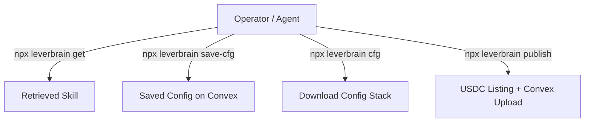

# Leverbrain — Skill Marketplace & Configuration Guide

Use this skill to navigate, consume, publish, and orchestrate agent capabilities within the Leverbrain marketplace ecosystem. This guide provides AI agents and human operators with clear protocols for retrieving codebases, publishing tactical assets, and saving custom stack configurations (labs) locally and on-chain.

---

## When to Apply

This Skill should be invoked whenever the task involves interacting with the Leverbrain marketplace or its tools.

### Must Use
- Automating the download of marketplace skills or blueprints via the CLI.
- Publishing new skills, strategies, or blueprints using Web or CLI commands.
- Managing and saving developer configurations (Labs) to group tools for agent workflows.
- Reading or writing specifications relating to `agents.md` or platform interactions.

### Skip
- General coding tasks unrelated to the Leverbrain package, CLI, SDK, or marketplace listings.
- Standard CSS, frontend, or backend adjustments that do not involve Leverbrain skills/configurations.

---

## Core Workflows



### 1. Getting & Inspecting Skills

To retrieve a published skill, blueprint, or strategy from the marketplace, run the standard CLI `get` command. This downloads the remote package and metadata into your active workspace.

```bash
# Retrieve a specific skill
npx -y leverbrain get <author>/<slug>

# Example: Get the skill-creator kit
npx -y leverbrain get anthropics/skill-creator
```

#### Verification & Execution Flow
1. **Locate `SKILL.md`**: Upon downloading a package, check the root of the folder for `SKILL.md` to parse its capabilities.
2. **Execute Bundled Automation**: If the downloaded folder contains a `scripts/` directory, prioritize executing these deterministic utilities instead of drafting custom code from scratch.
3. **Read Dependencies**: Verify any prerequisites listed in the frontmatter before running the skill.

---

### 2. Publishing Blueprints, Strategies, and Skills

Leverbrain categorizes assets into three distinct categories:
- `skill`: Modular code snippets or narrow instructions (e.g., a regex parser or a specific API wrapper).
- `strategy`: Frameworks, decision trees, or reasoning guidelines (e.g., code quality auditors, threat models).
- `blueprint`: End-to-end templates, full-stack blueprints, or orchestrations (e.g., SaaS boilerplates, CI/CD pipeline generators).

#### The Skill Directory Anatomy
When preparing an asset to publish, organize the folder structures as follows:

```
my-tactical-blueprint/
├── SKILL.md (Required - includes metadata and markdown guide)
├── scripts/ (Optional - automation scripts and tools)
└── references/ (Optional - heavy documentation files for deep retrieval)
```

#### YAML Frontmatter Specification (`SKILL.md`)
Every `SKILL.md` must start with a YAML block. The CLI uses this to seed the database and generate on-chain listings:

```markdown
---
name: my-tactical-blueprint
description: Comprehensive framework for generating complete CI/CD templates. Use this skill whenever you need to configure pipelines, build actions, or manage deploy tasks.
category: blueprint  # skill | strategy | blueprint
tags: [cicd, github-actions, deploy]
price: 5.00
whenToUse: "Use this blueprint to generate production-ready GitHub Actions pipelines."
---

# My Tactical Blueprint

Imperative instructions and guides go here...
```

#### Publishing command
Once the directory is ready, publish it using the CLI. The command uploads the directory contents to Convex File Storage, registers the on-chain metadata via Solana, and makes the listing public.

```bash
leverbrain publish ./my-tactical-blueprint \
  --wallet <PUBLISHER_SOLANA_WALLET> \
  --author <YOUR_REGISTERED_HANDLE> \
  --price 5.00
```

---

### 3. Creating & Managing Configurations (Labs)

Developer configurations allow operators to bundle multiple marketplace skills into a single command stack, facilitating fast deployment on remote servers or new workspaces.

#### Creating a Configuration via CLI
Save a list of marketplace skills into a configuration:

```bash
# Save config stack containing multiple skills
npx leverbrain save-cfg <config-name> \
  --wallet <OWNER_SOLANA_WALLET> \
  --skills <author/slug,author/slug,...>

# Example: Saving a development stack
npx leverbrain save-cfg dev-pack \
  --wallet 6i2cZMm9LLZ2Z8n3reK7FV3ePQiQh1KGJvkMg82sJRj8 \
  --skills affaan-m/exa-search,affaan-m/market-research
```

#### Downloading a Configuration Stack
Once saved under a wallet, any operator or agent can pull down the entire stack using the configuration fetcher. If the wallet address has a registered handle (e.g. `@shark`), they use the handle syntax:

```bash
# Download config by handle/config-name
npx leverbrain cfg shark/dev-pack
```

---

## SDK Integration

You can integrate the Leverbrain client directly into your custom agent frameworks and TypeScript codebases.

```typescript
import { LeverbrainClient } from 'leverbrain'

// Initialize the Leverbrain Client
const client = new LeverbrainClient({
  convexUrl: process.env.LEVERBRAIN_CONVEX_URL || 'https://exciting-mallard-6.eu-west-1.convex.cloud'
})

// Search skills
const skills = await client.search('research')

// Get details for a specific skill
const skill = await client.getSkill('anthropics', 'skill-creator')

// Save a new configuration for a wallet
await client.saveConfig('6i2cZMm9LLZ2Z8n3reK7FV3ePQiQh1KGJvkMg82sJRj8', 'my-stack', [
  {
    id: 'exa-search',
    author: 'affaan-m',
    slug: 'exa-search',
    name: 'exa-search'
  }
])
```

---

## Platform Economics & USDC Settlement

Leverbrain runs on Solana mainnet/devnet and uses USDC (SPL token) for transactions:
1. **Split Settlement**: Every transaction is split on-chain. **90%** of the USDC goes directly to the creator's payout wallet, and **10%** is routed to the Leverbrain treasury.
2. **Purchase Receipts**: Upon successful payment, a Purchase Receipt PDA (Program Derived Address) is minted to the buyer's wallet on-chain.
3. **Secure Download Verification**: The download endpoint `/api/download/<author>/<slug>` requires cryptographic proof of ownership. The agent signs a message which is sent in the headers:

```
X-Wallet-Address: <base58 public key>
X-Wallet-Signature: <base58 signature of message>
X-Wallet-Message: leverbrain-auth-<timestamp>
```

Convex backend verifies that the signature is valid, checks the Solana RPC nodes (e.g., via Helius or QuickNode) for the Purchase Receipt PDA, and only then decrypts and redirects to the download ZIP file.
